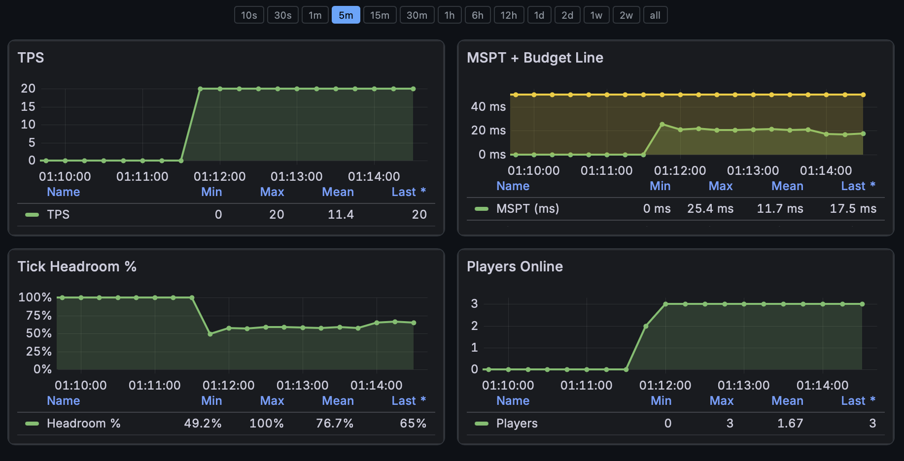

# Enigmatica 10

Minecraft server for Enigmatica 10 modpack (v1.30.0, MC 1.21.1, NeoForge).  
Hosted on projectmellon.de, 12 GB RAM, 5–8 concurrent players.

Built on [itzg/minecraft-server](https://github.com/itzg/docker-minecraft-server) Docker image.



## Landing Page — https://e10.projectmellon.de

Public page, no login needed. Shows server status and four live graphs:

1. **TPS** — Ticks per second. 20 = perfect. Lower = lag.
2. **MSPT** — Milliseconds per tick, with 50ms budget line. Spikes mean something is expensive.
3. **Tick Headroom %** — How much of the 50ms tick budget is still free. Drops before TPS does.
4. **Players** — Concurrent players over time.

Each graph has a time range selector: 10s · 30s · 1m · 5m · 15m · 30m · 1h · 6h · 12h · 1d · 2d · 1w · 2w · all.

The page also shows the server MOTD, current player count, and a whitelist request form.

## Features

| Feature                                                            | Status     |
| ------------------------------------------------------------------ | ---------- |
| Live status (MOTD, players, online/offline)                        | ✅         |
| Whitelist request from landing page                                | ✅         |
| Admin dashboard (whitelist, RCON, MOTD editor, file browser, logs) | ✅         |
| Waiting Cage (20×20 adventure mode, released via "Go!" button)     | ✅         |
| Borg backups every 30 min (48h hourly + 30 daily + 12 weekly)      | ✅         |
| Grafana dashboards (TPS, MSPT, headroom, players)                  | ✅         |
| Ansible deploy, backup, restore, rollback                          | ✅         |
| E2E test suite                                                     | ✅         |
| Test instance (port 25580, 6 GB)                                   | ✅         |
| Discord bridge (chat + join/leave)                                 | ⬜ planned |
| Live map (Bluemap)                                                 | ⬜ planned |
| Grafana alerts → Discord                                           | ⬜ planned |

## Architecture

Two Minecraft instances, shared monitoring stack:

```
PROD:  mc:25565 → host:25585  |  SRV: _minecraft._tcp.e10 → projectmellon.de:25585
TEST:  mc:25565 → host:25580  |  SRV: _minecraft._tcp.test.e10 → projectmellon.de:25580
```

```
Caddy (TLS termination)
├── e10.projectmellon.de     → flask:5000
└── grafana.e10.projectmellon.de → grafana:3000

Shared stack (Flask Web-UI + Prometheus + Grafana)
├── PROD instance (12 GB, itzg/minecraft-server:java21)
└── TEST instance (6 GB, itzg/minecraft-server:java21)
```

## Deploy

```bash
# Pause old servers
ansible-playbook -i ansible/inventory/hosts.yml ansible/playbooks/pause-homestead.yml

# Deploy
ansible-playbook -i ansible/inventory/hosts.yml ansible/playbooks/deploy.yml

# Watch logs
journalctl -t e10-prod -t e10-test -t e10-shared -f
```

## Project layout

```
e10/
├── ansible/          # Playbooks: deploy, backup, restore, rollback, update
├── docs/             # Web concept, research notes
├── prod/             # Production Docker Compose + world data
├── test/             # Test instance Docker Compose
├── shared/           # Prometheus, Grafana, Flask Web-UI, Caddy
│   └── webui/        # Flask app + Jinja2 templates
├── tests/            # E2E test suite (mcstatus, requests)
└── screenshots/
```

## Links

|              | URL                                  |
| ------------ | ------------------------------------ |
| Landing page | https://e10.projectmellon.de         |
| Grafana      | https://grafana.e10.projectmellon.de |
| Test server  | `test.e10.projectmellon.de`          |

## Docs

- [DEPLOY.md](DEPLOY.md) — deploy guide, backup commands, DNS, Caddy
- [HANDOVER.md](HANDOVER.md) — checklist for server owner
- [docs/web-concept.md](docs/web-concept.md) — UI design spec
- [AGENT.md](AGENT.md) — agent context (server specs, architecture)
